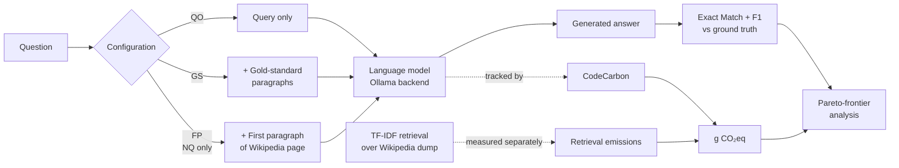

# Smaller, Smarter, Greener ⚡

> A 0.6B-parameter model with retrieval beats a 32B model without it — at 14% of the carbon. *Sometimes.* This repo measures when, and on what kinds of questions.

This is the code, data, and analysis for the paper:

📄 **Smaller, Smarter, Greener: Reducing LLM Inference Emissions with RAG**
*Ethan Heavey & Paul Cook (University of New Brunswick)* **39th Canadian Conference on Artificial Intelligence (Canadian AI 2026)**, Vancouver, BC, May 25–29, 2026.

## TL;DR

Inference, not training, is what most of an LLM's lifetime carbon footprint comes from once a model is deployed at scale — yet evaluations almost always report accuracy without reporting energy. We measure both, jointly, across 14 model configurations spanning three families (DeepSeek-R1, Qwen3, Gemma 3) and two QA datasets (HotpotQA, Natural Questions).

The headline result is that **small + RAG can dominate big + parametric** along *both* axes simultaneously. On Natural Questions, DeepSeek-R1 GS 1.5B reaches F1 = 0.24 against DeepSeek-R1 QO 32B's F1 = 0.14 while emitting **14% of the CO₂**. On HotpotQA, RAG always boosts F1 but doesn't always cut emissions — multi-hop reasoning extends generations enough that the savings can disappear.

## The two research questions

> **RQ1.** Can smaller LMs with RAG achieve higher F1 than larger LMs without RAG?
>
> **RQ2.** Can smaller LMs with RAG be more efficient (lower CO₂) than larger LMs without RAG?

Both have been asked separately in prior work. The contribution here is asking them *together*, on the same configurations, with the same instrumentation — which is what makes Pareto-frontier analysis possible.

## Experimental pipeline



**Configurations:**

- **QO (Query Only)** — model receives the question alone. Baseline: pure parametric knowledge.
- **GS (Gold Standard)** — model receives the question plus the dataset's annotated supporting paragraphs. Upper bound for what retrieval *could* contribute if retrieval were perfect.
- **FP (First Paragraph, NQ only)** — model receives the question plus the first paragraph of the Wikipedia page linked to the query. A cheap, reproducible retrieval proxy.

**Models** (14 configurations total, single-GPU constraint):

| Family | Sizes evaluated | CoT? |
|---|---|---|
| DeepSeek-R1 | 1.5B, 7B, 14B, 32B | Yes (reasoning tokens) |
| Qwen3 | 0.6B, 1.7B, 4B, 8B, 14B, 32B | Optional (off in this paper) |
| Gemma 3 | 1B, 4B, 12B, 27B | No |

The largest model in each family is run only in QO — the comparison of interest is "smaller-with-RAG vs. larger-without."

**Emission accounting:** CodeCarbon, RTX 4090, Ryzen 7 7800X3D, 64GB RAM, run in New Brunswick (293.62 g CO₂eq/kWh). Retrieval emissions measured directly for HotpotQA (4.22 g CO₂eq for 1,000 questions); estimated for NQ using the HotpotQA measurement since NQ's gold paragraphs were human-selected.

**No token-length constraint** on outputs — token counts reflect each model's native verbosity, including DeepSeek's chain-of-thought tokens. This is a deliberate choice (following prior work) and turns out to be one of the main drivers of cross-family differences.

## Headline results

### Natural Questions — small + RAG wins decisively

| Configuration | F1 | g CO₂eq | Notes |
|---|---|---|---|
| DeepSeek-R1 QO 32B | 0.14 | 1332 | Largest non-RAG baseline |
| **DeepSeek-R1 GS 1.5B** | **0.24** | **183** | +71% F1, **14% of emissions** |
| Qwen3 QO 4B (best Qwen QO) | 0.24 | 332 | |
| **Qwen3 GS 1.7B** | **0.46** | **32** | +92% F1, **10% of emissions** |
| Gemma 3 QO 12B (best Gemma QO) | 0.30 | 31 | |
| **Qwen3 GS 0.6B** | **0.34** | **29** | +13% F1, *lower* emissions, **20× smaller** |

The mechanism is straightforward: when ground-truth context is in the prompt, models stop dithering. NQ answers are short entities. Fewer output tokens → less compute → less CO₂.

### HotpotQA — nuanced

The same pattern shows up on F1 (RAG consistently wins) but breaks down on emissions. Multi-hop questions force models to reason over the retrieved context, producing *longer* outputs. Qwen3 GS 14B tops the F1 leaderboard at 0.47 but generates 78k tokens to do so (vs. QO 14B's 7k). The Pareto frontier on HotpotQA includes 6 points — 2 QO, 4 GS — with the GS configurations winning on F1 but paying for it in carbon.

The interpretive line from the paper: *RAG's carbon benefits depend on whether retrieval reduces the generative burden (NQ) or merely shifts it to more complex reasoning (HotpotQA).* That sentence is the paper's actual contribution — the F1 wins were expected, the carbon-cost split between dataset types was not.

Full per-model tables are in Appendix A of the paper.

### The DeepSeek tax

DeepSeek-R1 models never appear on the HotpotQA Pareto frontier and rarely on NQ's, despite being competitive on F1. The reason is the chain-of-thought reasoning tokens: DeepSeek configurations output **orders of magnitude more tokens** than comparable Qwen3 or Gemma 3 models. Reasoning has a measurable carbon cost, and on these QA tasks it doesn't pay back.

## Repository structure

```
.
├── src/
│   ├── cache/            # cached Wikipedia text for retrieval (.pkl)
│   ├── config.py         # experiment config: models, modes, paths, batch sizes
│   ├── experiment.py     # main orchestrator
│   ├── inference.py      # model loading + generation (Hugging Face + Ollama)
│   ├── retrieval.py      # TF-IDF Wikipedia retrieval
│   ├── scorers.py        # Exact Match + F1
│   ├── prompts.py        # QA prompt templates
│   └── utils.py          # helpers
├── data/                 # HotpotQA and NQ subsets (1,000 instances each)
├── emissions/            # CodeCarbon output logs
├── results/              # CSV outputs per experiment
├── requirements.txt
├── run_experiment.sh     # one-shot: venv setup → experiment → analysis
└── Objective Space Partitioning and Pareto Frontier Analysis.pdf
                          # supplementary methodology note
```

## Reproducing the experiments

```bash
git clone https://github.com/VeiledTee/SmallerSmarterGreener.git
cd SmallerSmarterGreener
pip install -r requirements.txt
```

You'll also need [Ollama](https://ollama.com/) installed and the relevant models pulled (`ollama pull deepseek-r1:7b`, etc.).

**One-shot pipeline** — sets up the venv, runs the experiment, runs analysis, versions the results:

```bash
chmod +x run_experiment.sh
./run_experiment.sh
```

**Manual** — useful when iterating on individual pieces:

```bash
# 1. Edit src/config.py to choose model_candidates, modes, dataset paths
python src/experiment.py        # runs the full evaluation, writes results/ and emissions/
python src/analysis.py          # post-hoc summary
```

Long experiments support resumption — if a run is interrupted, restarting picks up where it left off based on `results/` and `emissions/`.

## Carbon-intensity caveat for replicators

Our absolute emission numbers are specific to the **New Brunswick, Canada grid (293.62 g CO₂eq/kWh)** — one of the lower-carbon regions in North America thanks to a heavy nuclear + hydro mix. The *relative* findings (small+RAG vs. large QO) are grid-independent and will replicate anywhere, but the absolute g CO₂eq numbers will scale linearly with your local grid intensity. If you run this on a coal-heavy grid (e.g., parts of the US Midwest at ~700 g CO₂eq/kWh), expect to roughly double every number in our tables.

## Limitations and future work
Several directions worth pursuing:

- **More tasks.** Only QA was evaluated. Fact verification, open-domain relation extraction, and domain-specific QA (healthcare, legal) would all be reasonable next steps.
- **More model families.** Qwen3.5, Gemma 4, and NVIDIA's Nemotron-Cascade are obvious targets.
- **Output-length constraints.** The decision to leave token length unconstrained means some efficiency differences are confounded by verbosity. A controlled comparison at fixed output lengths would isolate this.
- **Dense retrieval.** We used TF-IDF for reproducibility with HotpotQA's original setup. Contemporary dense retrievers might shift the retrieval-emissions term.
- **Chain-of-thought analysis.** The DeepSeek tax is striking enough to deserve its own paper. When *does* CoT pay back its carbon cost?

## Citation

```bibtex
@inproceedings{
will update when available
}
```

## Acknowledgements
This work was supported by the Natural Sciences and Engineering Research Council of Canada (NSERC), RGPIN-2023-5871.

## License
Code: see repository. The paper is © 2026 by the authors and licensed under [CC BY 4.0](https://creativecommons.org/licenses/by/4.0/legalcode).
